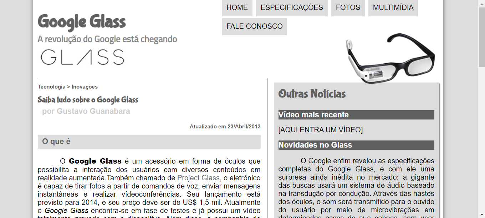

# GOOGLE GLASS
👨‍🏫PROJETO FEITO PARA O CURSO DE HTML E CSS DO CURSO EM VIDEO.

  

  

## DESCRIÇÃO:
Este é um código HTML que representa uma página da web sobre o Google Glass. Aqui estão as principais partes do código:

### HTML (`index.html`):
1. **Meta Tags e Título:**
   - Define o conjunto de caracteres e o título da página como "Tudo sobre Google Glass".

2. **Vinculação de Estilos e Scripts:**
   - Vincula um arquivo de estilo externo (`_css/estilo.css`) e um arquivo JavaScript (`_javascript/funcoes.js`).

3. **Corpo do Documento (`<body>`):**
   - Contém uma `
` com o identificador `interface` que agrupa todo o conteúdo.

4. **Cabeçalho (`<header>`):**
   - Inclui um título (`<h1>`) e um subtitulo (`<h2>`) sobre o Google Glass.
   - Uma imagem (``) com o identificador `icone` é exibida.

5. **Menu (`<nav>`):**
   - Um menu de navegação contendo links para as seções principais do site.

6. **Seção do Corpo (`<section>`):**
   - Contém um artigo principal (`<article>`) que fornece informações sobre o Google Glass.
   - Inclui cabeçalho, texto, imagens e uma tabela técnica.

7. **Barra Lateral (`<aside>`):**
   - Apresenta informações adicionais, como vídeos e notícias sobre o Google Glass.

8. **Rodapé (`<footer>`):**
   - Contém informações de direitos autorais, links para o perfil GitHub do criador e um link para o canal Telegram.

### JavaScript:
1. **Script Externo (`_javascript/funcoes.js`):**
   - Contém uma função `mudaFoto` que parece alterar uma foto com base em eventos de mouse. Essa função é usada nos links do menu.

### Considerações Adicionais:
   - Há um foco significativo na organização do conteúdo em seções como cabeçalho, corpo e rodapé.
   - A estrutura está semântica, utilizando tags HTML apropriadas para diferentes partes do conteúdo.
   - São utilizados atributos como `onmouseover` e `onmouseout` para eventos de mouse nos itens do menu.
   - A página incorpora imagens e vídeos para fornecer informações visuais.
   - O design é complementado por um arquivo de estilo externo (`_css/estilo.css`).
   - Há referências a arquivos e diretórios, Tendo uma estrutura organizada do projeto com subdiretórios para CSS, JavaScript e imagens.

